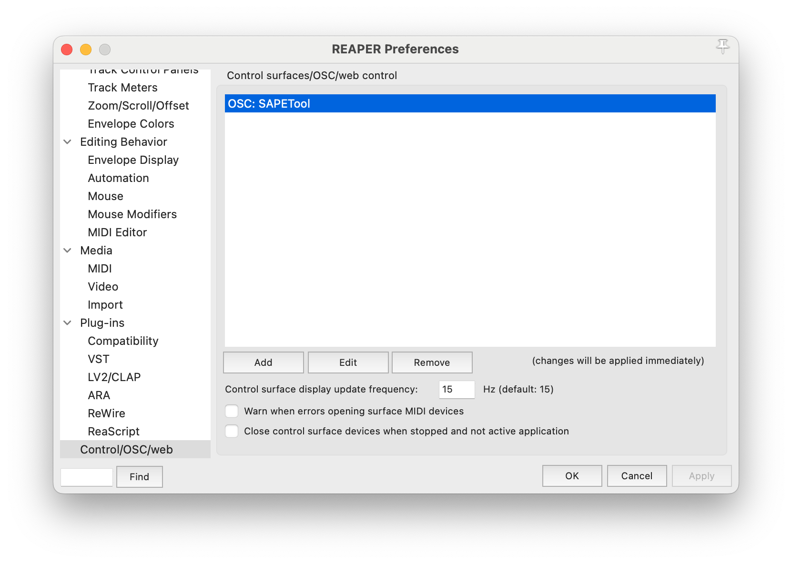
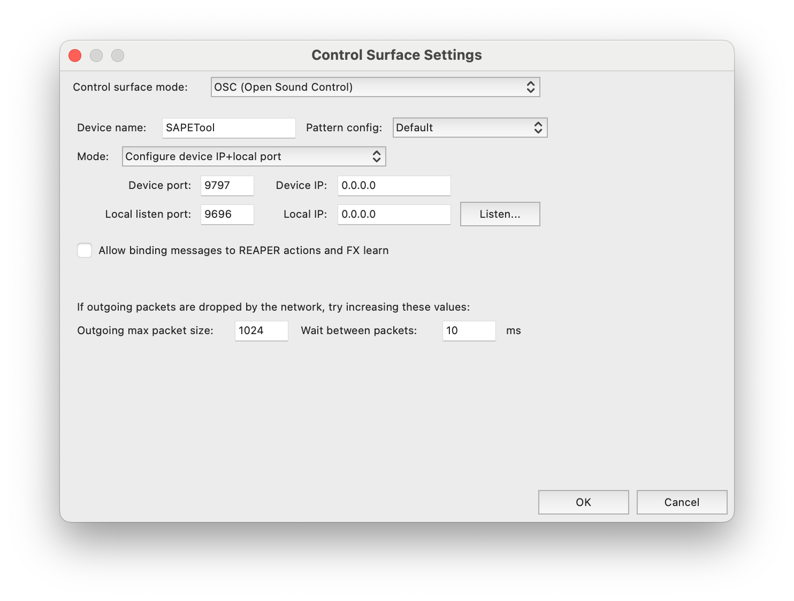

# REAPER-MUSHRA: Listening test tool for DAW-based perceptual evaluation of spatial audio

This repository contains source code of REAPER-MUSHRA - a listening test app designed for running MUSHRA-like evaluations using [REAPER](https://reaper.fm) and real-time spatial audio rendering. The app can be used for perceptual evaluation of spatial audio codecs, binaural rendering algorithms, virtual acoustics, etc.

The initial release of this software has been described in the 145th AES Convention [Engineering Brief 465](https://www.aes.org/e-lib/browse.cfm?elib=19730).

## Key features
- Implemented MUSHRA [1] test paradigm.
- Straightforward test preparation by setting up the DAW session.
- Multichannel playback of the listening test stimuli.
- Flexible signal processing – each sample can have its own designated decoder.
- Easy implementation of head tracking.
- Multi-platform support: macOS, Windows, Linux (not tested).

## Implementation
- Created in C++ utilizing [JUCE](https://github.com/juce-framework/JUCE) framework.
- Open Sound Control (OSC) messages are used for communication between the app and REAPER.

## Reaper setup
A REAPER template session can be found at `/reaper_template/reaper_template.RPP`. 

Experimental conditions are organized as separate tracks. Each track which name starts with `##` is treated by the app as a condition of the test. The reference condition should be placed at the top of the track list in order to be triggered by the Reference button within the app.

Experimental trials are defined by markers. Each trial starts and ends with a marker.

To enable OSC communication between the app and REAPER add a generic OSC device. See screenshots below. 

## Usage
- Import test audio samples to Reaper.
- Set up the required signal processing chain.
- Launch the Main Listening Test App.
- Configuration of the listening test app will be done automatically based on the DAW session structure.
- Conduct the test and save the results into a text file.

## References
[1] *ITU-R, “BS.1534-3: Method for the subjective assessment of intermediate quality levels of coding systems,” 2015.*
